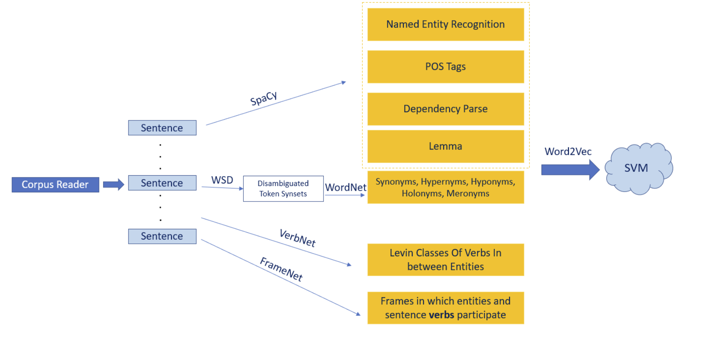
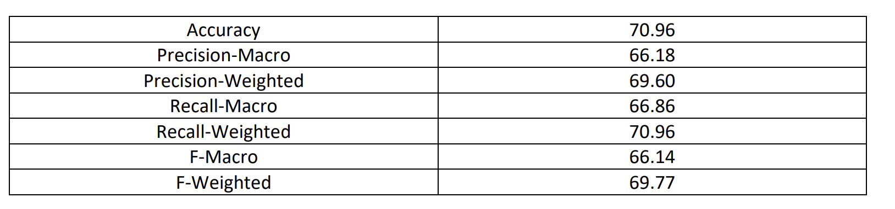
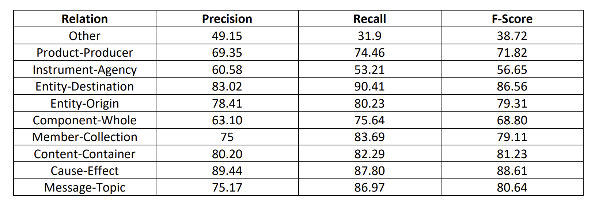

# Entity-Relationship-Identifier
A deep Natural Language Processing pipeline which successfully classifies the relationship between two marked entities. This relationship is a two-part identity: first, we must classify the nature of the relationship between the entities, and then we must classify the direction of that relationship. To clarify "direction", suppose we have two entities e1 and e2, who are related by the Component-Whole relation. The directiction of the relationship will identify whether e1 is a component of e2 (the whole) or vice versa. This Readme will briefly go over the features used, the libraries necessary to run this, and results.

## Feature Engineering 

We perform the following in order to generate various features 
* Tokenization and Lemmatization
* Part of Speech tagging
* Dependency Parse
* Word Sense Disambiguation (WSD)
* WordNet Features
* FrameNet Features
* VerbNet Features

This project is written in Python. I will describe the libraries and files needed, and describe how to run
the project, here. 

## Required Libraries
You will need the following Python libraries for this project to work normally:
* Gensim
* NLTK
* SpaCy
* Networkx
* Scikit-Learn
* Joblib
* TerminalTables

Furthermore, you will need the following WordNet corpora:
* WordNet
* FrameNet
* VerbNet

## Corpora
To download the corpora, simply do the following in a terminal (I have used FrameNet as an example, it
is similar for the others):
Import nltk
nltk.download(‘framenet_v17’)

## Files
The following files are necessary for the project (they should all be in the same folder):
* demo.py
* tester.py
* processor-verbnet.py
* processor-display.py
* CorpusReader.py
* Embedder_vn.py
* main_verbnet.py

You will also need the semeval training and test files in the same folder, which I have not
included in this repository. demo.py is the demo application where you can input a sentence
and see the features and the classification. Tester.py tests it for the whole dataset. However,
both demo.py and tester.py expect there to be both the SVM model and the word2vec model
present, so if you run them first you will get errors. The first program you should run is
main_verbnet.py. This will create all the necessary models, and it takes about an hour and half
to train the SVM and store it. Once the file has executed at least once and the models are
created, you can then use demo.py to play around with input sentences that you type in, or use
tester.py to test on the whole semeval test file (which must be present for it to work). Testing
on the whole dataset takes about 1316 seconds, as mentioned in the report.
main_verbnet.py, demo.py and tester.py are the main files here. All the other files work as
helpers: CorpusReader reads the files and stores them in memory in a data structure, the
processor files process the data and extract features, the Embedder_vn.py file contains the
code for creating the word embeddings via genism.

Please let me know if you run into any issues when running the project!

## Results

The results for this pipeline are shown below. 

In the first table, we say that a prediction is "correct" if both the nature of the relationship as well as it's direction are classified correctly.

In the second table, we show the precision, recall and F1 score when we are concerned with only classifying the nature of the relationship.

